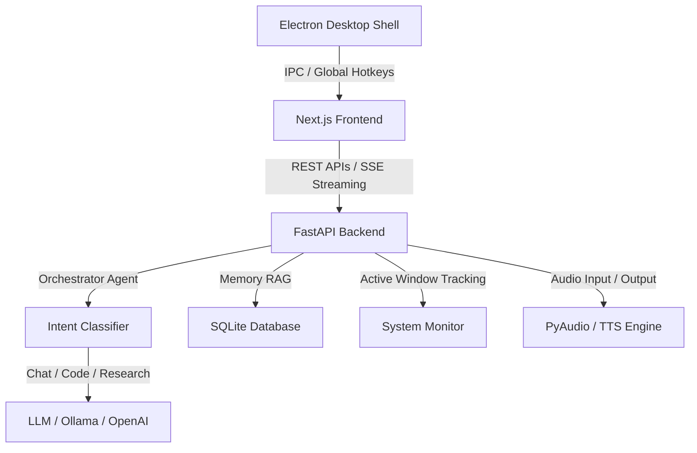

# 🎙️ JARVIS AI Assistant v2.4.0

An advanced, multi-agent AI desktop assistant featuring a premium glassmorphic HUD visualizer, real-time voice interaction, semantic memory, active window/situational context tracking, and live system analytics.


---

## ✨ Features

- **🕸️ 3D Three.js HUD Visualizer**: High-performance 3D WebGL particle sphere visualizer that responds dynamically to real-time microphone volume (Web Audio API) and tilts interactively on mouse move.
- **🎙️ ElevenLabs Voice Integration**: Real-time ultra-realistic cloned voice feedback with settings panel key manager and seamless offline local fallback.
- **🧠 Complex Multi-Agent Chaining**: Intelligent orchestrator-level coordination that chains agent behaviors (e.g. performing web research to gather documentation, then feeding it directly into the coding agent).
- **📂 Workspace Scraper**: Automatically scans active workspace files to build contextual briefings of recent code alterations.
- **⚡ Priority Rule-Based Routing**: Instant processing for local system commands (weather telemetry, volume adjustments, application launches) bypassing slow LLM classification steps.
- **🧠 Semantic Long-Term Memory (RAG)**: A persistent SQLite-backed memory system. JARVIS can automatically remember facts, store user preferences, and fetch contextually relevant memories on the fly.
- **🖥️ Desktop HUD Dashboard**: Open the visual dashboard instantly using the global hotkey (`Ctrl + Space`) or interact using voice-only commands.
- **📊 Real-time Telemetry & Diagnostics**: Live trackers for CPU, RAM, and disk utilization with smooth animated meters, including listing top memory-consuming processes.
- **🛡️ Intent Classification & Security Guard**: Classifies queries into intents (system, browser, code, memory, chat). Critical commands require user confirmation before executing.

---

## 🏗️ Architecture



---

## 🛠️ Tech Stack

- **Frontend**: Next.js 14, TypeScript, Tailwind CSS, Three.js, Framer Motion, Lucide React, `react-markdown`, `remark-gfm`.
- **Backend**: FastAPI (Python), PyAudio, SQLite, OpenAI / OpenRouter / Ollama API clients.
- **Desktop Shell**: Electron.

---

## 🚀 Getting Started

### 📋 Prerequisites

- **Python 3.10+** (Make sure Python is added to your environment `PATH`)
- **Node.js 18+**
- **Git**
- *(Optional)* **Ollama** (for local offline LLMs)

### 🔧 Installation

1. Clone the repository:
   ```bash
   git clone <your-repository-url>
   cd proud-meitner
   ```

2. Configure Environment Variables:
   Copy `.env.example` to create your `.env` file and fill in your keys:
   ```bash
   copy .env.example .env
   ```

### ⚡ Running JARVIS

To make launching simple, we have provided a single batch script that installs all dependencies (both Python and Node.js) and runs the backend, frontend, and Electron app concurrently.

Simply run the batch script from the root folder:
```bash
.\run_jarvis.bat
```
